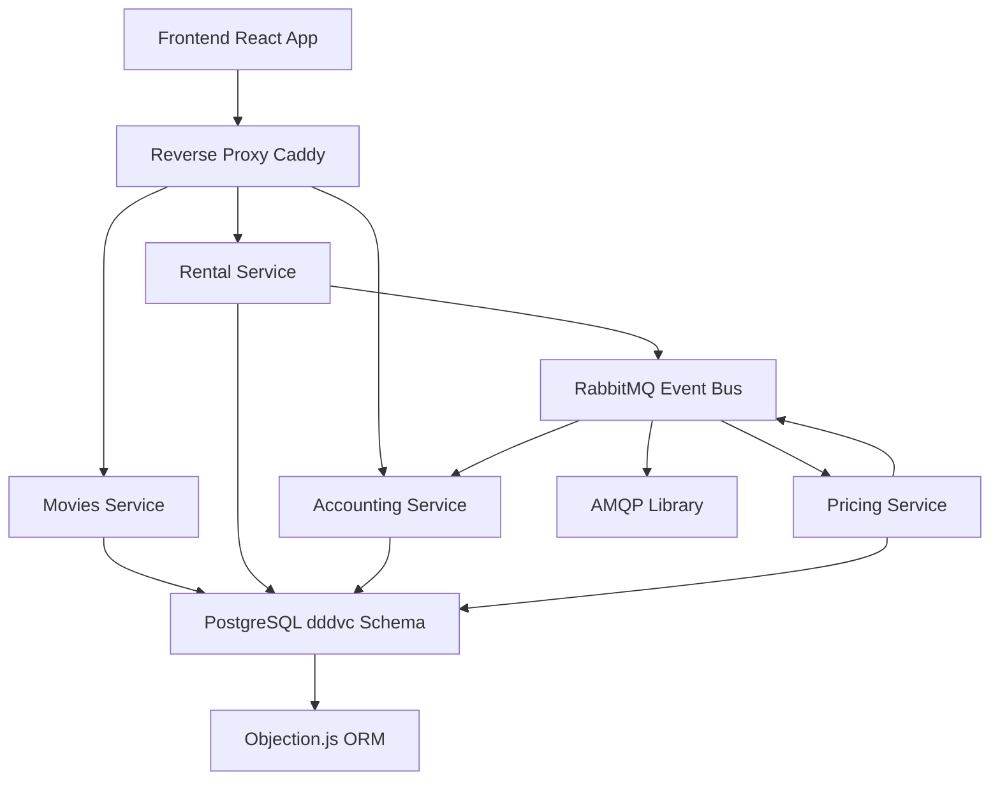

# Architecture: DDD Video Club v2

## System Architecture
The application follows a hexagonal (ports and adapters) architecture combined with Domain-Driven Design (DDD) principles. It is structured as a monorepo using pnpm workspaces, separating business domains (bounded contexts) from infrastructure concerns. Each bounded context (Movies, Rental, Pricing, Accounting) is implemented as an independent package with its own domain model, application services, and adapters for HTTP and persistence.

Key architectural decisions:
- **Bounded Contexts**: Each domain (e.g., Movies for catalog management, Rental for transactions) is isolated to enforce single responsibility and reduce coupling.
- **Event-Driven Communication**: Services communicate asynchronously via an event bus (RabbitMQ) using domain events (e.g., `MOVIE_RENTED` triggers pricing and accounting). This ensures loose coupling and eventual consistency.
- **Ports and Adapters**: Domain logic is pure (no infrastructure dependencies). Ports define interfaces (e.g., repositories, event bus), while adapters implement them (e.g., PostgreSQL repository, AMQP event bus).
- **Layered Structure per Package**:
  - `domainmodel/`: Entities (e.g., Movie, Rental), Value Objects (e.g., ReadModels), Domain Services (e.g., PricingService), Repositories (interfaces), Application Services (orchestration).
  - `adapter/`: Infrastructure implementations (HTTP routers with Express, persistence with Objection.js).
  - `src/main.ts`: Bootstraps the service, wiring adapters and starting the HTTP server.
- **Reverse Proxy**: Caddy routes requests to services (e.g., `/api/movies` -> Movies service on port 4000).
- **Database**: Single PostgreSQL schema (`dddvc`) shared across contexts, with Knex migrations for tables (movies, rentals, discount_campaigns, accounts, account_entries).

## Source Code Paths
- Root: Configuration (TypeScript, ESLint, Prettier), build scripts.
- `packages/`:
  - `movies/`: Movie catalog (domainmodel/Movie.ts, adapter/persistence/MovieRepositoryImpl.ts).
  - `rental/`: Rental transactions (domainmodel/Rental.ts, publishes MOVIE_RENTED).
  - `pricing/`: Pricing logic (consumes MOVIE_RENTED, publishes MOVIE_RENTAL_PRICED; includes Vitest tests).
  - `accounting/`: Account management (consumes MOVIE_RENTAL_PRICED; domainmodel/Account.ts as aggregate).
  - `database/`: Knex migrations (e.g., 20231012122837_movies.js), Objection models, transaction provider.
  - `event-bus/`: RabbitMQ connection (EventBusImpl.ts).
  - `event-types/`: Shared event definitions (index.ts).
  - `frontend/`: React app (src/Master.tsx layout, src/MovieSelection.tsx, src/MyAccount.tsx).
  - `reverse-proxy/`: Caddyfile for routing.

## Design Patterns in Use
- **DDD Patterns**: Aggregates (Account with Entries), Entities (Movie, Rental), Value Objects (ReadModels, Commands), Repositories (interfaces), Domain Services (PricingService), Application Services (e.g., RentalAppService for orchestration), Domain Events (MovieRentedEvent).
- **Hexagonal Architecture**: Core domain isolated; outer adapters for I/O (HTTP, DB, Events).
- **CQRS Influence**: Separate read models (e.g., MovieSelectionReadModel) and commands (RentMovieCommand).
- **Dependency Injection**: Factories like `getRentalAppService` inject ports (e.g., TransactionProvider, EventBus).
- **Event Sourcing Lite**: Events drive state changes (e.g., rental -> pricing -> accounting), but no full event store.

## Component Relationships

- **Flow**: User rents movie (Frontend -> Rental via Proxy) -> Publish MOVIE_RENTED -> Pricing consumes, calculates, publishes MOVIE_RENTAL_PRICED -> Accounting consumes, updates balance.
- **Critical Paths**:
  - Rental creation: Transactional (Objection) + Event publish (fire-and-forget).
  - Pricing: Query discounts by category/date, apply reductions (base 350 cents/day).
  - Account update: Aggregate balance on debit entry.

## Key Technical Decisions
- **TypeScript Strict**: Enforces types for domain models; no runtime checks needed.
- **Shared Schema**: Simplifies demo but couples contexts (in production, consider per-context DBs).
- **No Auth**: Dummy customer ID for educational focus.
- **Testing**: Integration tests in Pricing mock ports; unit tests via Vitest.
- **Deployment**: Local Docker for DB/Event Bus; tmuxinator for orchestration.

This architecture prioritizes modularity and testability, aligning with DDD for complex domains.