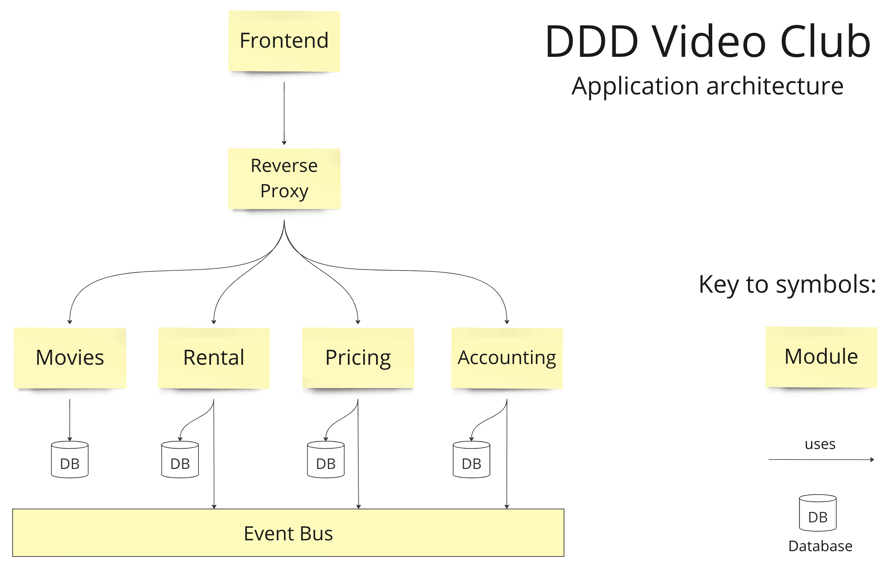

# ddd-video-club


Sample for [Matthias Bohlen](https://mbohlen.de)'s
[Domain-Driven Design class](https://mbohlen.de/domain-driven-design-cpsa-a/)
(iSAQB Advanced Level).

It is a small application to rent movies for a few days, watch them inside a
browser, and be billed for this.

Kind of "poor man's Netflix".

It demonstrates how to design such a thing using DDD, and how to implement it in TypeScript
on NodeJS, using the principles of the "ports and adapters" architectural style, as described by
Alistair Cockburn.

## Packages in the `packages` directory

The app consists of the following conceptual modules:

- Movies (using NodeJS)
- Rental (using NodeJS)
- Pricing (using NodeJS)
- Accounting (using NodeJS)

Additionally, there are 3 technological modules:

- Database (using PostgreSQL)
- Event Bus (using RabbitMQ)
- Reverse Proxy (using Caddy Server)

Finally, there is a frontend using React and Tailwind.



## How to build

Install Node. Then go to the root folder of this project here and type

```
corepack enable
yarn
yarn build
```

You should see an output like this:

```
[@ddd-video-club-v2/database]: Process started
[@ddd-video-club-v2/event-bus]: Process started
[@ddd-video-club-v2/event-bus]: Process exited (exit code 0), completed in 2s 910ms
[@ddd-video-club-v2/event-types]: Process started
[@ddd-video-club-v2/database]: Process exited (exit code 0), completed in 3s 503ms
[@ddd-video-club-v2/frontend]: Process started
[@ddd-video-club-v2/event-types]: Process exited (exit code 0), completed in 2s 301ms
[@ddd-video-club-v2/frontend]: Creating an optimized production build...
[@ddd-video-club-v2/frontend]: Compiled successfully.
[@ddd-video-club-v2/frontend]: ...
[@ddd-video-club-v2/frontend]: Process exited (exit code 0), completed in 12s 316ms
[@ddd-video-club-v2/accounting]: Process started
[@ddd-video-club-v2/movies]: Process started
[@ddd-video-club-v2/movies]: Process exited (exit code 0), completed in 3s 521ms
[@ddd-video-club-v2/pricing]: Process started
[@ddd-video-club-v2/accounting]: Process exited (exit code 0), completed in 3s 850ms
[@ddd-video-club-v2/rental]: Process started
[@ddd-video-club-v2/pricing]: Process exited (exit code 0), completed in 3s 173ms
[@ddd-video-club-v2/rental]: Process exited (exit code 0), completed in 3s 331ms
Done in 23s 8ms
```

## How to run

### Start the database and initialize the schema

```
cd packages/database
docker-compose up -d
sleep 30
yarn knex migrate:latest
```

### Start the event bus

```
cd packages/event-bus
docker-compose up -d
```

### Start the API servers

1) Open a new terminal and type this:

```
cd packages/movies
yarn dev
```

2) Open a new terminal and type this:

```
cd packages/rental
yarn dev
```

3) Open a new terminal and type this:

```
cd packages/pricing
yarn dev
```

4) Open a new terminal and type this:

```
cd packages/accounting
yarn dev
```

### Start the reverse proxy

Install [Caddy server](https://caddyserver.com/) on your local machine.

On a Mac, using Homebrew, it works with `brew install caddy`.

Then start a new terminal and type this:

```
cd packages/reverse-proxy
caddy run
```

### Start the frontend

Start a new terminal and type this:

```
cd packages/frontend
yarn dev
```

See the frontend open on http://localhost:3000/

Choose one of the three movies, rent it for 5 days and click on "Your account"
to see how much you will have to pay this month. If you find this too expensive,
insert a row into the discount_campaigns table:

```SQL
INSERT INTO dddvc.discount_campaigns
(campaign_title, starting_from, valid_thru, movie_category_name, percentage)
VALUES (
	'SF discount',
	now(),
	now() + interval '7 days',
	'Science Fiction',
	20
);
```

This will introduce a 20% discount on Science Fiction movies for the next 7 days.

Try to rent the Matrix movie once more and inspect your account again.

## Automate the start of the 4 microservices and the 3 infrastructure processes

There is a configuration file for tmuxinator in this directory. It is
called `.tmuxinator.yml`. (Thanks to @AlexZeitler who generously provided
this file.)

It starts all necessary processes in the right
order. First, the database, the event bus, and the reverse proxy come up.
Then, the 4 microservices start. At last, the frontend starts and begins
to use the 4 microservices via the reverse proxy.

Start tmuxinator with the following command:

```
tmuxinator start
```

More info:

- https://github.com/tmuxinator/tmuxinator
- https://man7.org/linux/man-pages/man1/tmux.1.html

## Run the integration test in Pricing

The Pricing module has an integration test at the application
service level, with mock objects to substitute the event bus and
the database during the test. The purpose is to show how the ports-and-adapters
style keeps such applications testable.

Run it like this:

```
cd packages/pricing
yarn test
```

Terminate the test with the `q` key on your keyboard.
